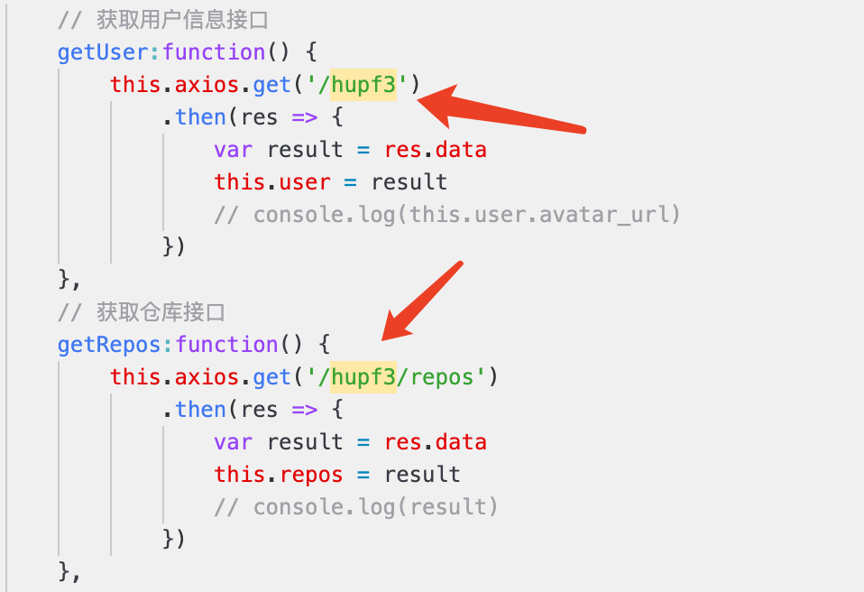

# myGithub

## 介绍

本仓库用来存储自己根据 `github` 官方 `API` 做的 `github` 个人主页

如果您是 `TA`，请移步到 [specification](./specification.md) 进行检查，那里有更详细的设计过程

## 框架选择

`Vue-cli`

## 运行方法

- 将项目克隆到本地

  `git clone https://github.com/hupf3/myGithub.git`

- 进入到项目目录

  `cd myGithub/myGithub`

- 安装项目依赖

  `npm install`

- 启动项目

  `npm run dev`

- 在网页中输入 [http://localhost:8080](http://localhost:8080) 即可查看页面（**注意**：需要将浏览器最大化，否则展示效果不好，推荐浏览器 `Google Chrome`）

- **注意**：运行后显示的 `github` 用户是 `hupf3` 也就是笔者自己，如果想看别人的 `github` 主页可以修改 [GitHub.vue](./myGithub/myGithub/src/components/GitHub.vue) 文件中的 `hupf3` 修改为任意用户名，示例如下：

  

## 当前成果展示

**个人主页全貌：**

**页面标题以及 logo：**

