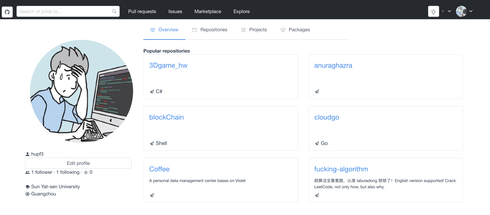

# myGithub

## 介绍

本仓库用来存储自己根据 `github` 官方 `API` 做的 `github` 个人主页

## 框架选择

`Vue-cli`

## 使用方法

- 将项目克隆到本地

  `git clone https://github.com/hupf3/myGithub.git`

- 进入到项目目录

  `cd github_pro`

- 安装项目依赖

  `npm install`

- 启动项目

  `npm run dev`

- 在网页中输入 `localhost:8080` 即可查看页面

## 当前成果展示

