# Github 首页制作
- [Github 首页制作](#github-首页制作)
  - [实验代码](#实验代码)
  - [实验环境](#实验环境)
  - [运行说明](#运行说明)
  - [展示成果](#展示成果)
    - [页面展示](#页面展示)
    - [网页标题及图标](#网页标题及图标)
    - [网页底部](#网页底部)
  - [接口调试](#接口调试)
  - [细节实现](#细节实现)
    - [接口访问](#接口访问)
    - [整体框架](#整体框架)
    - [页面标题和图标](#页面标题和图标)
    - [头部](#头部)
    - [底部](#底部)
    - [中部左边](#中部左边)
    - [中部右边](#中部右边)
  - [实验总结](#实验总结)
## 实验代码

本次页面实现的代码都在下面的链接，[传送门](./myGithub/src/components/Github.vue)，请 `TA` 进行查看

## 实验环境

`Vue-cli` + `Google Chrome`

本次实验引用了 `iView` 官方组件，[iView官网](https://www.iviewui.com/)

## 运行说明

- 将项目克隆到本地

   `git clone https://github.com/hupf3/myGithub.git`

- 进入到项目目录

   `cd myGithub`

- 安装项目依赖

   `npm install`

- 启动项目

  `npm run dev`

- 在网页中输入 `localhost:8080` 即可查看页面（**注意**：需要将浏览器最大化，否则展示效果不好）

## 展示成果

本部分只展示大致的页面的效果，具体的功能和细节的展示在下方会详述

### 页面展示

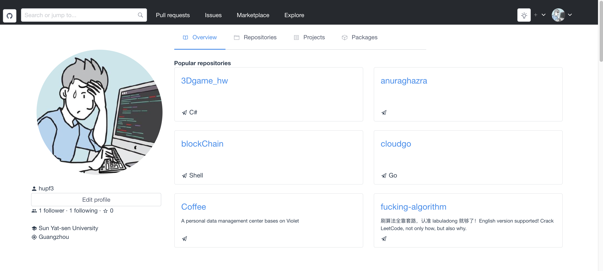

### 网页标题及图标

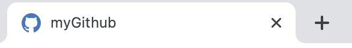

### 网页底部

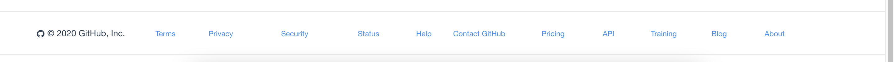

## 接口调试

本次实验使用的接口都是根据 `github` 官方给出的接口文档进行调试的

**Github 官方 API 文档**：[传送门](https://docs.github.com/cn/free-pro-team@latest/rest/reference/users)

**调试工具**：`Postman`

本次实验中常用的接口，如下：

- 获取用户资料

  `https://api.github.com/users/hupf3`

  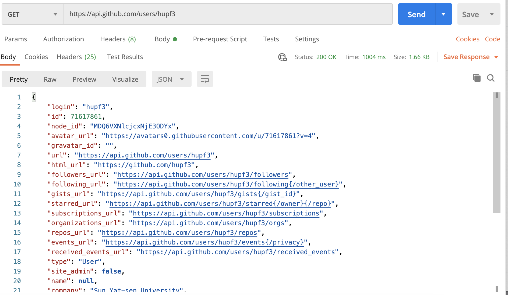

- 获取用户仓库

  `https://api.github.com/users/hupf3/repos`

  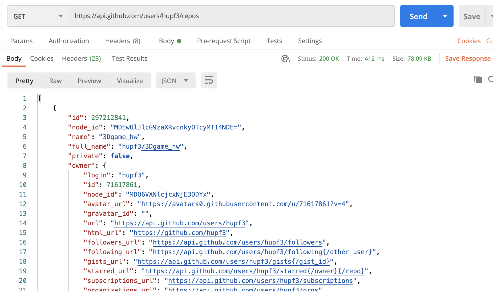

## 细节实现

本次实验的页面主要由头部，底部，中部左边个人信息，中部右边菜单栏构成。也设计了页面的标题和图标，下面就分别讲述各部分实现的过程。

### 接口访问

在 `<script>` 内部写好了两个函数，分别用来发送 `GET` 请求，分别获取用户的信息，和用户仓库的信息，并且保存到 `user`，`repos` 变量中

```js
// 获取用户信息接口
getUser:function() {
  this.axios.get('/hupf3')
    .then(res => {
    var result = res.data
    this.user = result
    // console.log(this.user.avatar_url)
  })
},
  // 获取仓库接口
  getRepos:function() {
    this.axios.get('/hupf3/repos')
      .then(res => {
      var result = res.data
      this.repos = result
      // console.log(result)
    })
  }
```

将这两个函数在 `created` 周期函数中调用，即可实现在创建该页面的时候就可以获取到二者的数据

```js
created () {
  // 获取个人数据
  this.getUser()
  // 获取仓库
  this.getRepos()
},
  data () {
    return {
      user:{},
      repos:[],
			...
    }
  }
```

### 整体框架

整体的框架是用 `<Row>` 组件进行布局的，该组件将页面横向分成了三个部分，分别放置头部，中部，底部的信息

```vue
<!-- 设置头部 -->
<Row style="background:#25292e;height:60px;">
  ...
</Row>
<!-- 中部 -->
<Row>
  ...
</Row>
<!-- 底部 -->
<Row>
  ...
</Row>
```

### 页面标题和图标

先放一下原版和我设计的对比图：

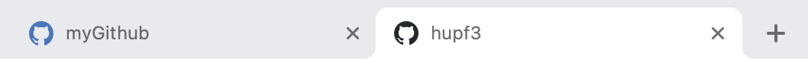

我将网页的标题设置为 `myGithub` ，并将图标设计成了蓝色的 `logo` 改图像我是从 [iconfont](https://www.iconfont.cn) 上下载的资源。具体的设计代码如下：

```vue
<link rel="shortcut icon" href="./static/github.png">
<title>myGithub</title>
```

### 头部

首先展示对比图：


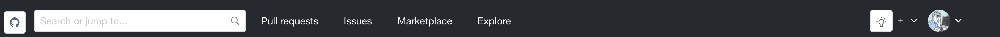

可以说是基本实现了所有部件的展示，最左面的 `logo` 是由 `<Button>` 实现的

```vue
<Button icon="logo-github"></Button>
```

然后是一个由 `<Input>` 组件实现的搜索框

```vue
<Input suffix="ios-search" placeholder="Search or jump to..." style="background:#25292e;width: 300px;height:35px" />
```

右面是四个可以点击出发跳转链接的按钮

```vue
<!-- 四个功能选项框 -->
<Col style="text-align:left" span="8">
  <Button type="text" ghost to="https://github.com/pulls">Pull requests</Button>
  <Button type="text" ghost to="https://github.com/issues">Issues</Button>
  <Button type="text" ghost to="https://github.com/marketplace">Marketplace</Button>
  <Button type="text" ghost to="https://github.com/explore">Explore</Button>
</Col>
```

最右边是根据原 `github` 主页设计的两个下拉框，是由 `<Dropdown>` 组件实现的，成果展示如下：

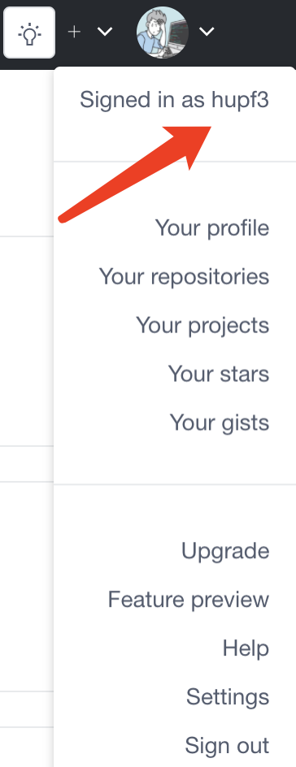

上图可以看到已经获取到了自己的用户名，具体在代码中获取的方法如下：

```vue
<DropdownItem>Signed in as {{user.login}}</DropdownItem>
```

可以看到头像也是成功获取到了，图像的展示使用了 `<Avatar>` 组件，并且将从接口中获取到的图片地址在属性中进行赋值，即可成功展示图片

```vue
<Avatar :src=user.avatar_url />
```

### 底部

首先展示对比图：

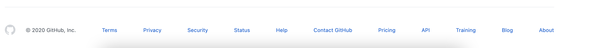

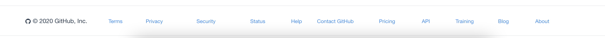

底部实现的主要就是一个 `logo` 以及各个可以点击的链接构成的，下面展示部分代码：

```vue
 <Col span="3">
   <p style="text-align:left"><Icon type="logo-github"/> © 2020 GitHub, Inc.</p>
</Col>
<Col span="1">
  <a style="font-size:10px" src="https://docs.github.com/en/free-pro-team@latest/github/site-policy/github-terms-of-service">Terms</a>
</Col>
```

### 中部左边

首先展示对比图：

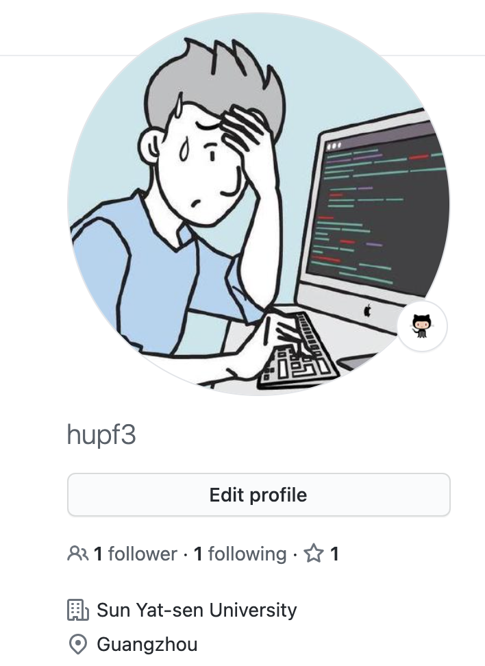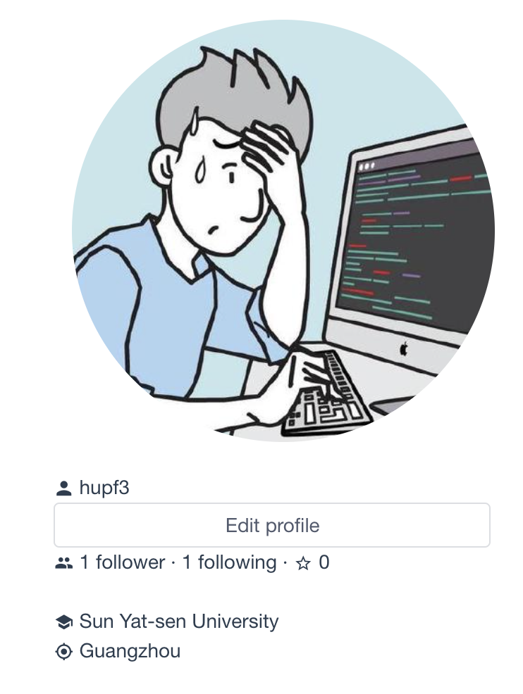

可以看到有自己的头像，用户名，关注自己的人以及自己关注的人，地点，公司等信息，并且有一个按钮进行修改信息。

个人信息都是由接口获取到的：头像 `user.avatar_url`、关注者 `user.followers`、被关注者 `user.following`、公司 `user.company`、地点 `user.location`，这些信息的展示都放到 `<Card>` 组件中，并配上适当的 `icon` 图标

```vue
<Card dis-hover :bordered="false" style="text-align:left">
  <p><Icon type="md-person"/> {{user.login}}</p>
  <Button style="width:310px"><p>Edit profile</p></Button>
  <p><Icon type="md-people"/> {{user.followers}} follower · {{user.following}} following · <Icon type="md-star-outline"/> 0</p>
  <br/>
  <p><Icon type="md-school"/> {{user.company}}</p>
  <p><Icon type="md-locate"/> {{user.location}}</p>
</Card>
```

### 中部右边

右边的菜单上方有四个可选择的选项，分别对应了显示不同的页面：

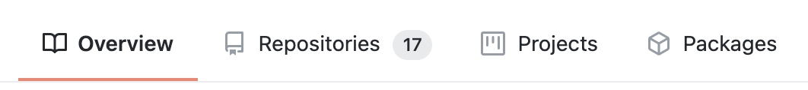

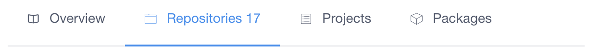

```vue
<Row style="width:600px">
  <Menu mode="horizontal" active-name="1" @on-select="handleChange">
    <MenuItem name="1">
      <Icon type="md-book" />
      Overview
    </MenuItem>
    <!-- <MenuItem name="2" to="/Repositories"> -->
    <MenuItem name="2">
      <Icon type="ios-folder-outline" />
      Repositories {{user.public_repos}}
    </MenuItem>
    <MenuItem name="3">
      <Icon type="ios-list-box-outline" />
      Projects
    </MenuItem>
    <MenuItem name="4">
      <Icon type="ios-cube-outline" />
      Packages
    </MenuItem>
  </Menu>
</Row>
```

页面之间的切换我是用的 `v-if` 进行判断的，根据不同的值来选择不同的模块显示：

```vue
<!-- 选择展示6个仓库 -->
<Row style="text-align:left" v-if="isOverview">
  </Row>
<!-- 展示仓库 -->
<Row style="text-align:left" v-if="isRepositories">
</Row>
<!-- 展示项目 -->
<Row style="text-align:left" v-if="isProjects">
</Row>
<!-- 展示packages -->
<Row style="text-align:center" v-if="isPackages">
</Row>
```

并且写了一个切换页面的方法函数，主要是对不同的变量进行赋值:

```js
// 切换页面
handleChange(params) {
  if (params == 1){
    this.isOverview = true
    this.isRepositories = false
    this.isProjects = false
    this.isPackages = false
  }else if (params == 2){
    this.isRepositories = true
    this.isOverview = false
    this.isProjects = false
    this.isPackages = false
  }else if (params == 3){
    this.isProjects = true
    this.isOverview = false
    this.isRepositories = false
    this.isPackages = false
  }else if (params == 4){
    this.isPackages = true
    this.isOverview = false
    this.isProjects = false
    this.isRepositories = false
  }
}
```

下面就分别介绍各个页面的实现：

- `Overview`：该页面展示了从接口获取到的前六个仓库，作为代表显示出来，显示结果如下所示：

  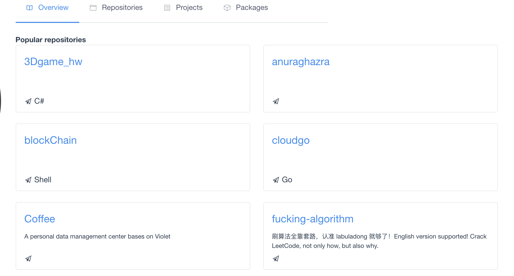

  每个仓库的展示我是用组建 `<Card>` 实现的，每一个 `Card` 都是由仓库的名字 `repos[0].name`，仓库的描述 `repos[0].description`，仓库中主要用到的语言 `repos[0].language` 构成的，并且点击每一个仓库的名称都能够直接跳转到仓库的详细内容页面：

  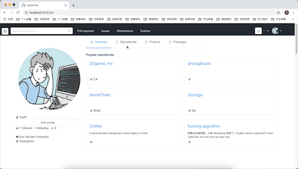

  [如果动图无法显示请点击此处](./img/1.gif)

  下面展示其中一个仓库的展示代码：

  ```vue
  <h4>Popular repositories</h4>
  <Col span="12">
    <Card dis-hover style="text-align:left;width:450px;height:130px;">
      <Row style="height:40px"><p style="font-size:20px"><a :href=repos[0].html_url>{{repos[0].name}}</a></p></Row>
      <Row style="height:40px"><p style="font-size:10px">{{repos[0].description}}</p></Row>
      <Row style="height:40px"><p style="font-size:15px"><Icon type="md-paper-plane" /> {{repos[0].language}}</p></Row>
    </Card>
  </Col>
  ```

- `Repositories`：该页面的头部由一个搜索框、两个下拉框、以及一个按钮构成，点击这个按钮会跳转到新建仓库的链接中：

  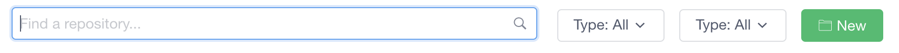

  ```vue
  <Button type="success" style="margin-left: 10px" to="https://github.com/new">  
    <Icon type="ios-folder-outline" /> New
  </Button>
  ```

  下面就是展示的从接口中获取到的我所有的仓库，显示这些仓库用到了 `<List>` 组建，每个 `ListItem` 中包括了仓库的名字，仓库用到的语言，仓库最近更新的时间，以及该仓库是否被 `star` 

  ```vue
  <List item-layout="vertical">
    <ListItem v-for="item in repos" :key="item.name">
      <br/>
      <h2><a :href=item.html_url>{{ item.name }}</a></h2>
      <template slot="extra">
  <li>
    <br/> <br/>
    <Button type="default" style="text-align:right">  
      <p v-if="item.stargazers_count === 0"><Icon type="md-star-outline" /> star</p>
      <p v-if="item.stargazers_count === 1"><Icon type="md-star" /> unstar</p>
        </Button>
        </li>
      </template>
      <br/>
      <p><Icon type="md-paper-plane" /> {{item.language}}</p>
      <br/>
      <p style="font-size:10px"><Icon type="ios-time-outline" /> Updated on {{item.updated_at}}</p>
    </ListItem>
  </List>
  ```

  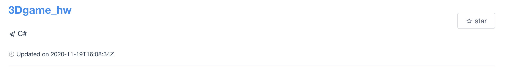

  仓库的星标功能虽然没有实现点击，但是实现了获取功能，如我在 `github` 页面中进行星标，通过接口获取到的信息也是星标，实例如下：

  

  [如果动图无法显示请点击此处](./img/2.gif)

- `Projects`：该页面展示了自己的 `Projects` 信息，并且有一个搜索框，和两个新添项目的按钮，页面中蓝色的链接文字是实现了跳转链接的功能的

  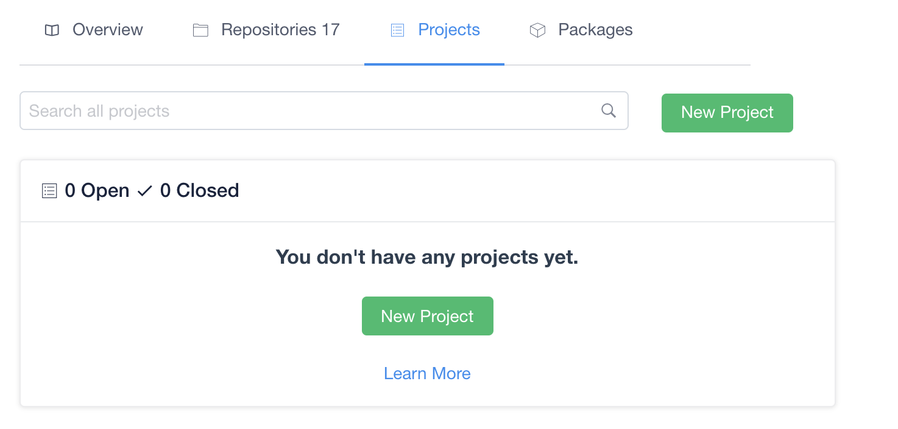

- `packages`：该页面展示了关于 `Github packages` 的一些信息，基本是按照原 `github` 页面进行了完美的还原：

  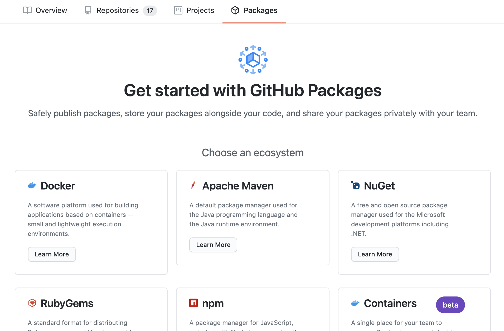

  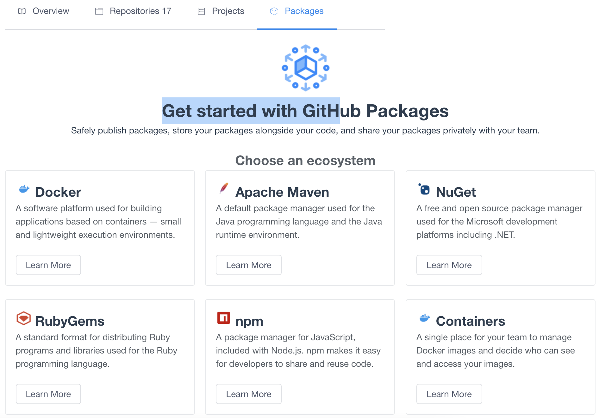

  并且每个 `Learn More` 按钮点击之后都会跳转到相应的链接中，图中的每个卡片都是由组件 `<Card>` 制作的：

  ```vue
  <Card :bordered="true" style="width:300px;text-align:left">
    <h2> Docker</h2>
    <p style="color:#596068">A software platform used for building applications based on containers — small and lightweight execution environments.</p>
    <br/>
    <Button to="https://docs.github.com/en/free-pro-team@latest/packages/using-github-packages-with-your-projects-ecosystem/configuring-docker-for-use-with-github-packages">Learn More</Button>
  </Card>
  ```

## 实验总结

通过本次实验学到了 `API` 的使用，看了官方文档之后，学到了如何写一份较好的 `API` 文档，也学会了前端和后端的交互功能。